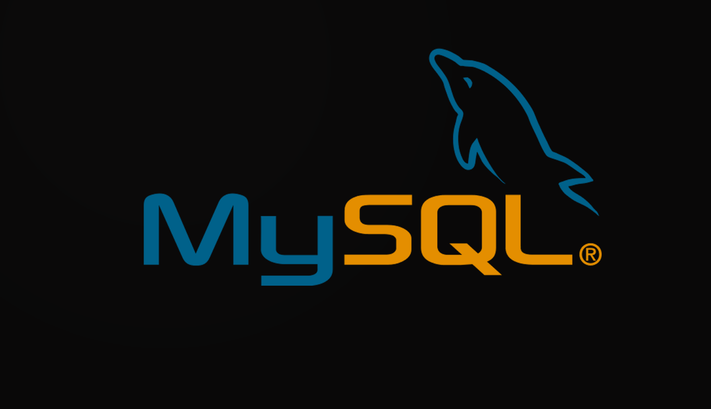
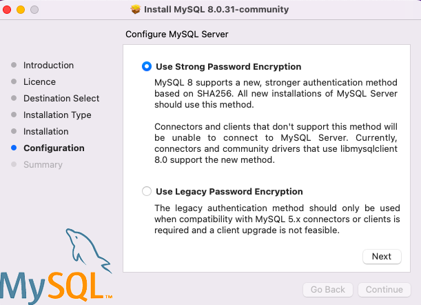
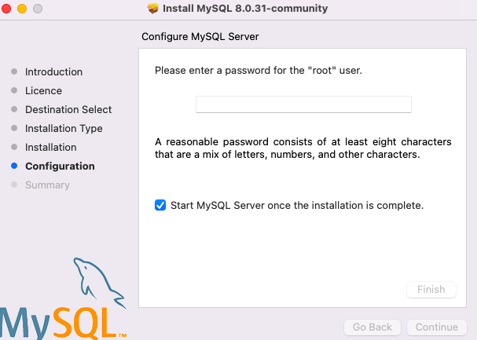
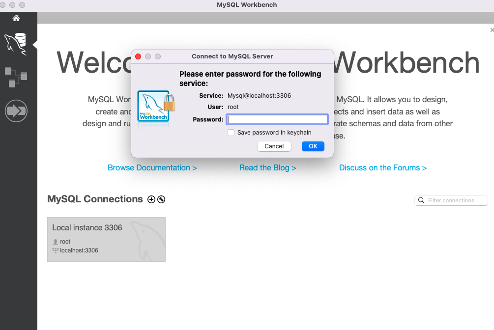
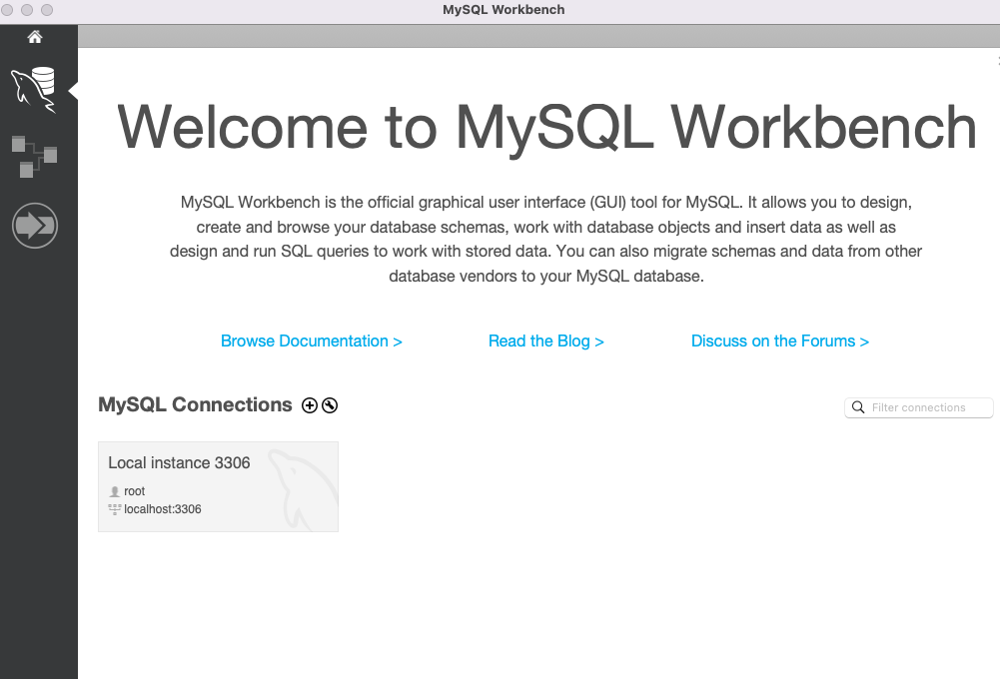
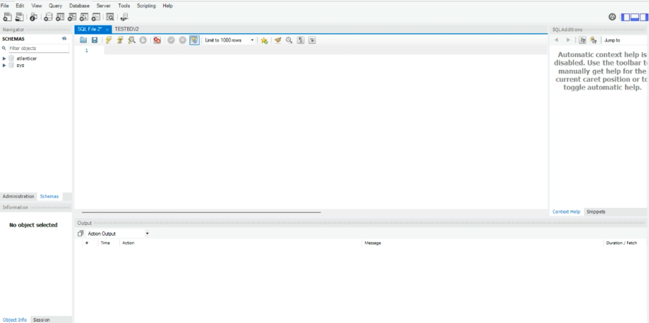
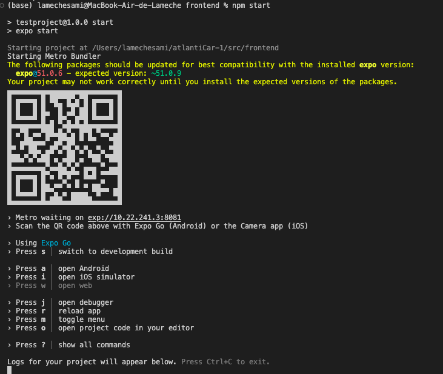

# 
# AtlantiCar

IMT Atlantique's CODEVSI Project, the carpooling service for now, tomorrow, the day after tomorrow, and beyond.


Clone this repository
```
git clone https://github.com/napoknot21/atlantiCar.git
```

Enter to the cloned directory
```
cd atlantiCar
```


## Prerequisites

In order to run this project, you must install and set up your environment. 

This config is divided into 3 main parts: Databse setup, server configuration and frontend configuration.

### Data Base



The project needs a database in order to manage the data of the application.

The project uses [MySQL](mysql.com), a popular relational database manager.

Depeding on your operating system, the installation may differ.

#### Windows and MacOS

For Windows and MacOS users, you will need to install the `MySQL Community Version` and `MySQL Workbench`.

THe project uses MySQL > `8.0.31`.

Select this version of MySQL in the following page :

- For [MySQL community](https://dev.mysql.com/downloads/installer/)
- For [MySQL Workbench](https://dev.mysql.com/downloads/workbench/)

> Don't forget to select your current architecture (X86_64, ARM, etc) when it's requested

During installation, select the `Use Strong Password Encryption` option for security reasons



Then enter the `root` password !


**Finally, don't forget your root password this will be useful then.**

Using `WorkBench`, create a connection to your database !

> Enter your `root` password

create the database named `atlanticar`

> This image shows that the connection to the database is established !

Run the `testSample.sql` script in the `./src/db` directory in order to fill the database !


if all it's ok, let's switch to the next phase !


#### Linux

Depending on your Linux Distribution, the name of the package will differ.

For `Debian` and `Debian based` distributions (`Ubuntu`, etc)
```
sudo apt install mysql-server
```
> Don't forget to update your system before installing the package.

For `ArchLinux` and `ArchLinux based` distributions (`ArcoLinux`, `Manjaro`, etc)
```
sudo pacman -S mysql
```

For other distributions, check the name of the mysql package respectively.

Run the daemon !
```
sudo systemctl start mysql.service
```

Once mysql is started, set up the `root` or your `$USER` password
```
sudo mysql -u root -p
```
> Change `root` by `$USER` if you prefer your current account

The command before will open a mysql session, enter this command
```
FLUSH PRIVILEGES;
ALTER USER 'root'@'localhost' IDENTIFIED BY 'YOURNEWPASSWORD';
FLUSH PRIVILEGES;
```
> Change `YOURNEWPASSWORD` by your real password.

Save your passwod, this will be useful for the rest.

Once done, restart the mysql service
```
sudo systemctl restart mysql.service
```

Now, it's time to create the database of our project
```
mysql -u root -pYOURPASSWORD < echo -n 'CREATE DATABASE atlanticar;'
```
> replace `root` by `$USER` if needed

Finally, enter to the `./src/db` directory and run `testSample.sql` file
```
cd ./src/db && mysql -u root -pYOURPASSWORD < ./testSample.sql
```
> replace `root` by `$USER` if needed

If all it's ok, let's switch to the next phase !


### Server

The project server technology is `NodeJS` and package manager is `npm`

Follow the next instructions in order to download and set up correctly depending on your operating system.

#### Windows / MacOS

Check the official website [here](https://nodejs.org/) and download the lastest `LTS version`

Execute it and that's all !

> The `npm` package will be installed by default


#### Linux

For `Debian` and `Debian based` distributions, open a terminal and run
```
sudo apt install nodejs
```

For `ArchLinux` and `ArchLinux based` distributions (`ArcoLinux`, `Manjaro`, etc)
```
sudo pacman -S nodejs
```

#### Configuration

Before to proceed, verify your `nodejs` and `npm` version
```
node -v && npm -v
```

You should have at least this version or newer !
```
v22.2.0
10.8.1
```

For security reasons, the project demand to create an `.env` file where you will write sensitive information about your database permissions.

We did not provide it directly in the source code beaucause some data will depend on your local configuration.


Given the project structure, create the `.env` file in the following path
```
./src/backend/
```
> Use the command `cd` to navigate to !

An example of the file's content looks like this
```
DB_HOST=localhost
DB_PORT=3306
DB_USER=MyUSer
DB_PASSWORD=MySecurePassword
DB_NAME=atlanticar
```
> Don't forget to adapt this information to your local MySql Setup. Here some examples
>
> `MyUser` : Could be replaced by `root` or `$USER`
> 
> `MySecurePassword` : Enter the real password you set up in the database config (cf. [here]())
>
> `DB_PORT` : By default the port is 3386. Change it only if your configuration is different.


The project uses a mail service for some functionalities. you must append these values at the end of the `.env` file.
```
MAIL_SERVICE=gmail
MAIL_HOST=smtp.gmail.com
MAIL_PORT=587
MAIL_USER=atlanticarservices@gmail.com
MAIL_PASSWORD=nlkeyzfikaigmlkz
```

The final content of your `.env` file should look like this
```
DB_HOST=localhost
DB_PORT=3306
DB_USER=MyUSer
DB_PASSWORD=MySecurePassword
DB_NAME=atlanticar
MAIL_SERVICE=gmail
MAIL_HOST=smtp.gmail.com
MAIL_PORT=587
MAIL_USER=atlanticarservices@gmail.com
MAIL_PASSWORD=nlkeyzfikaigmlkz
```
> Don't forget to adapt the values depending on your environment !

Once done, go the `./src/backend` directory and donwload all needed packages
```
npm install
```
> The `package-lock.json` file has all the required dependencies to install

Finally, run the ```server.js``` file
```
nodejs server.js
```

If the server is running correctly, you will see the following output in the terminal
```
Listening on port 3000
Connected to the MySQL database 
```


### Frontend

The project uses the `React` framework. More details [here](https://github.com/).

For interacting with the application, the project requires `ExpoGo`. More information [here](https://github.com/)

#### React


Go to the `./src/frontend` directory and run the following command
```
npm install
```
> The `package-lock.json` file has all the required dependencies to install

#### ExpoGO


Download the mobile application in the `Apple Store` or the `Android Store`


## Run the project

If the [Prerequisites] section was successfully installed and set up, then it's time to run the project

Use 2 terminals in order to run all the process required

In the first one, run the server in the `./src/backend` directory
```
nodejs server.js
```

In the second one, run the fronted application of the `./src/frontend` directory
```
npm start
```

> This will print a QR Code for the `ExpoGo` app

Finally, open the `ExpoGo` application and scan the QR Code of the `frontend` output

Use the default credentials to log in or create a new account
```
*Default credentials*

login  : jc@imt-atlantique.net
passwd : 1234
```

